# Comportamiento — docker-swarm

> meta: artefacto · RFC-007 · generado dev-enrich · anclado a `v0.10.0` · cobertura: 12 flujos load-bearing (8 backfill inicial + 4 nuevos: auth de registry privado, `Image.pull` síncrono, `Container.create`, partición query params/filters del listado)

## 1. Resumen

Flujos de ejecución load-bearing de `docker-swarm`: cómo se materializan en runtime las operaciones CRUD, el control de concurrencia optimista de Docker, la política de retries post-fix correctness, y el mapeo de errores. Render Mermaid sequenceDiagram/flowchart por flujo.

## 2. Cobertura declarada

### Documentados (12)

1. `Service.create` + reload
2. `Service.update` con `Version.Index`
3. `Service.restart` (force update)
4. `Model.destroy` (graceful 404)
5. Política de retries por método HTTP
6. Error mapping (HTTP status → excepción tipada)
7. `Container.start` / `Container.stop`
8. `Loggable#logs` streaming
9. Auth de registry privado (`RegistryAuth.resolve` → `X-Registry-Auth` / `registryAuthFrom`)
10. `Image.pull` síncrono (stream NDJSON → error tipado → resultado explícito)
11. `Container.create` con nombre por query string (`create_query_params`)
12. `Model.where` — partición query params propios vs. `?filters=` (`index_query_params`)

### No documentados (ausencia ≠ inexistencia, RFC-007)

- Reconexión / reapertura de socket Unix (Excon nativo, fuera de nuestra superficie).
- Flujo de configuración / boot (`DockerSwarm.configure`) — trivial, sin secuencia de interés.

## 3. Flujos

### 3.1 `Service.create` + reload

Crear un Service implica un POST seguido de un reload automático para hidratar la instancia con la respuesta completa de Docker (el endpoint `create` sólo devuelve `ID`).

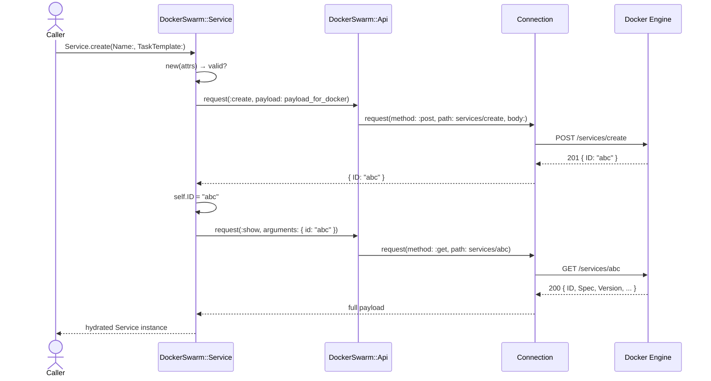

**Notas load-bearing:**
- `valid?` corre antes del POST. Si falla, `save` retorna `false` sin tocar el API.
- El POST no se reintenta automáticamente: ver §3.5 (retry policy).
- El reload usa `find` interno; si Docker devuelve 404 entre create+show (caso extremo), el reload no se realiza y la instancia queda sólo con `ID`.

### 3.2 `Service.update` con `Version.Index`

Updates atómicos sobre Service/Node/Network requieren enviar el `Version.Index` actual como query param. Sin él, Docker rechaza con 500. La gema lo extrae automáticamente de `self.Version["Index"]`.

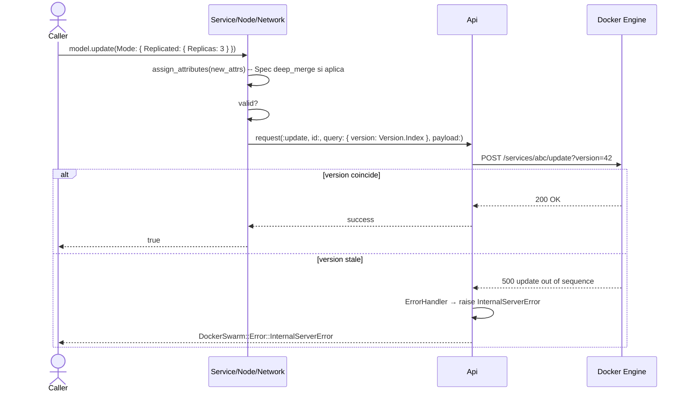

**Notas load-bearing:**
- `assign_attributes` muta el estado local **antes** de validar/enviar. Si el update falla, la instancia queda mutada (gotcha conocido, ver SKILL.md).
- `Spec` se mergea con `deep_merge`; otros atributos top-level se asignan directo.
- El update **no** hace reload automático (a diferencia de `create`). El caller llama `reload` si necesita el `Version.Index` nuevo.

### 3.3 `Service.restart` (force update)

Reinicio sin downtime equivalente a `docker service update --force`: incrementa `ForceUpdate` del `TaskTemplate` para que Docker recree todas las tasks.

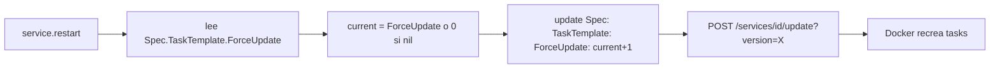

**Notas load-bearing:**
- Usa el flujo §3.2 internamente — hereda Version.Index, retry-policy y error-mapping.
- Si `Spec` o `TaskTemplate` no existen aún (instancia nueva sin reload), `current = 0`.

### 3.4 `Model.destroy` (graceful 404)

DELETE con tolerancia a 404: si el recurso ya fue eliminado, `destroy` retorna `nil` en vez de raise.

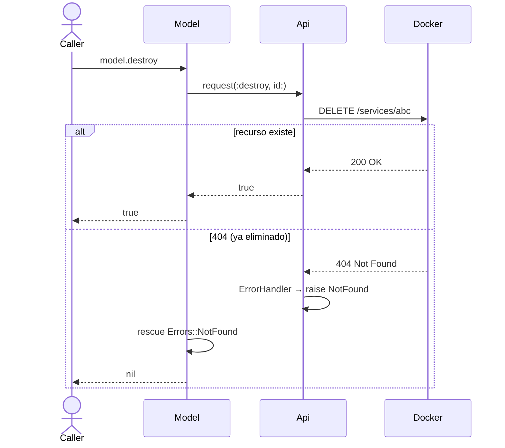

**Notas load-bearing:**
- Tanto `Model.destroy(id)` (class method) como `model.destroy` (instance) capturan `NotFound`.
- 409 (`Conflict` — recurso en uso) **no** se captura; el caller debe manejarlo si aplica.

### 3.5 Política de retries por método HTTP

Post-fix correctness (PR #3): los retries automáticos sólo aplican a métodos seguros. POST/PATCH no reintentan para evitar duplicados.

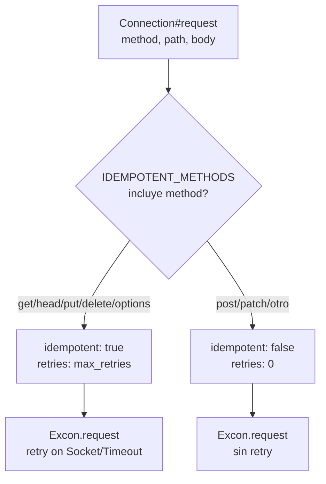

**Notas load-bearing:**
- Si el socket se cierra durante la lectura de la respuesta de un `services/create`, **no** se replica — la instancia queda en error y el caller decide.
- `max_retries` (default 3) sólo afecta lecturas/idempotentes.

### 3.6 Error mapping (status → excepción)

`ErrorHandler` interpreta status HTTP 4xx/5xx y emite excepción tipada de la jerarquía `DockerSwarm::Error`.

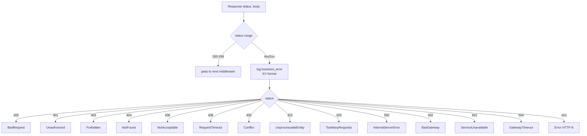

**Notas load-bearing:**
- Antes de raise, `ErrorHandler` emite un evento `business_error` en formato KV con `status`, `message`, `method`, `path`. Permite diagnosticar sin abrir backtrace.
- Errores de red (no HTTP) se mapean a `DockerSwarm::Error::Communication` en `Connection#request`.
- El mensaje de la excepción viene del body parseado: prefiere `body["message"]`, luego `body["error"]`, luego el body completo.

### 3.7 `Container.start` / `Container.stop`

Operaciones específicas sin payload (POST a endpoint dedicado).

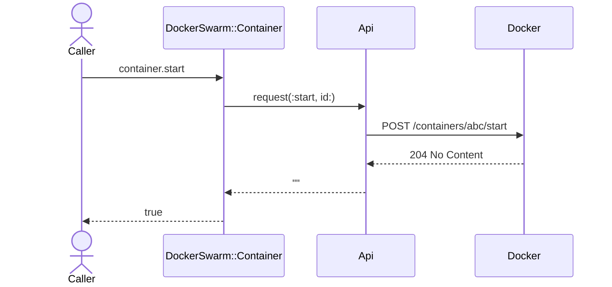

Mismo patrón para `stop`. POST sin body → no se reintenta automáticamente (§3.5).

### 3.8 `Loggable#logs` streaming

Obtención de logs para Service/Task/Container, ya demultiplexados.

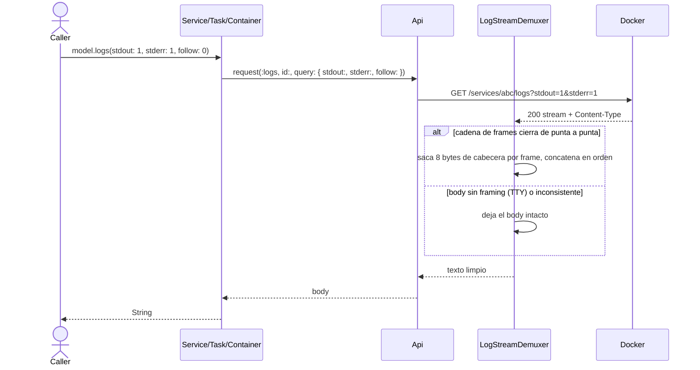

**Notas load-bearing:**
- El body no se parsea como JSON (`ResponseJSONParser` lo respeta porque el Content-Type no es `application/json`).
- **El demux vive en un middleware, no en `Loggable`:** `Connection#request` devuelve `response.body` y descarta los headers, así que aguas abajo ya no hay `Content-Type` con el que decidir (ADR-025 cláusula 3).
- **`raw-stream` no implica TTY.** Ese `Content-Type` era el único que existía antes de la API v1.42, y la gema no fija `?version=` → un Engine 20.10 devuelve `raw-stream` con framing. El middleware decide por la forma del frame, no por el header (detalle y cita del changelog en [`docs/consumed/docker-engine-api.md`](../consumed/docker-engine-api.md) §b).
- **Desviación de ADR-025, acotada.** La **Decisión** normativa (`ADR-025:130-131` — *"un middleware que decide por `Content-Type`"*) **se cumple**: el middleware corta si el header falta o no es uno de los dos. Lo que la implementación contradice es el **rationale de §Alternativas** (`ADR-025:106-107`), que da por sentado que `raw-stream` implica TTY. Ese dato de apoyo es falso para Engines que topan en la API v1.41. Asentar la corrección en el reino queda **pendiente**.
- **El demux limpia los frames, no separa señal de ruido.** `stdout` y `stderr` siguen intercalados en un solo String: quien necesite un dato puntual tiene que delimitarlo en origen.
- **Un frame partido entre chunks no se reensambla:** el demux es todo-o-nada, así que devuelve el body **intacto** en vez de texto a medias. El comportamiento está definido y cubierto por spec — los cuatro casos que pide `ADR-025:196-198` (cadena de frames, varios en un chunk, tamaño/cola truncados, TTY sin framing) están en `spec/docker/swarm/middleware/log_stream_demuxer_spec.rb`.
- `follow: 1` mantiene la conexión abierta — el caller debe manejar el stream/timeout. `[inferred]` Con `follow` el body no llega completo, así que el demux no aplica por diseño; no está ejercitado por spec ni contemplado en ADR-025 — es extrapolación de esta capa, no una limitación declarada por la ADR.

### 3.9 Auth de registry privado (`X-Registry-Auth` / `registryAuthFrom`)

El caller pasa una credencial **opaca base64url** (`registry_auth`) y/o la fuente a reusar (`registry_auth_from`). `RegistryAuth.resolve` valida **antes** de la request (exclusión mutua + enum del `from`) y traduce a canales de transporte, sin tocar el payload ni el estado del modelo. La credencial se sanitiza en logs vía `LogHelper`. Aplica a `Service.create`/`#update` e `Image.pull`.

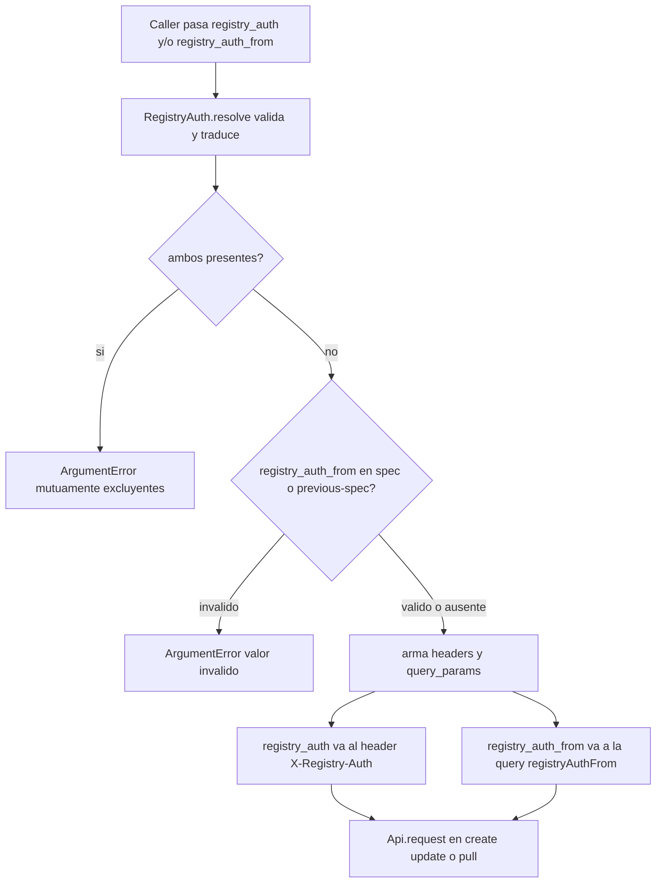

**Notas load-bearing:**
- La validación es **fail-fast local**: un caller que pasa ambos, o un `from` fuera de `spec`/`previous-spec`, corta con `ArgumentError` antes de tocar el Engine (no se deriva la ambigüedad a Docker).
- La credencial viaja **solo** por header/query — nunca en el payload ni en el estado del modelo. `LogHelper::SENSITIVE_KEYS` la enmascara en el wire-debug.

### 3.10 `Image.pull` síncrono (stream NDJSON → error tipado → resultado)

`Image.pull` es síncrono: consume el stream de progreso NDJSON hasta EOF, eleva error tipado ante un frame `error`/`errorDetail` (que Docker manda **con HTTP 200**), y solo tras terminación limpia devuelve un resultado explícito construido desde el stream — sin un `find` posterior.

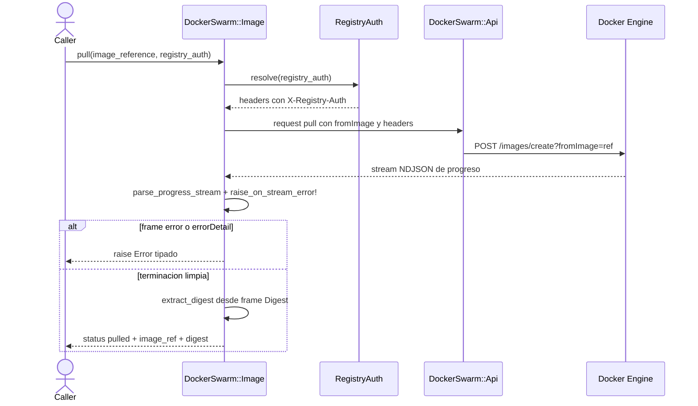

**Notas load-bearing:**
- El middleware entrega el stream como `String` (multi-frame NDJSON) o `Hash` (frame único); `parse_progress_stream` normaliza ambos a lista de frames.
- El digest sale del frame `Digest: sha256:...` (el stream de pull **no** trae campo `aux` — verificado contra Docker 29.5.3), escaneando desde el final.
- Es un `POST` → **no** entra en la política de retries (ver flujo 3.5).

### 3.11 `Container.create` con nombre por query string

El Engine toma el nombre del container por query string. En el body lo **descarta en silencio** y responde `201` igual: el container nace con nombre aleatorio, y una lógica de adopción por nombre determinista no lo encuentra → el reintento duplica en vez de adoptar (ADR-025 cláusula 1).

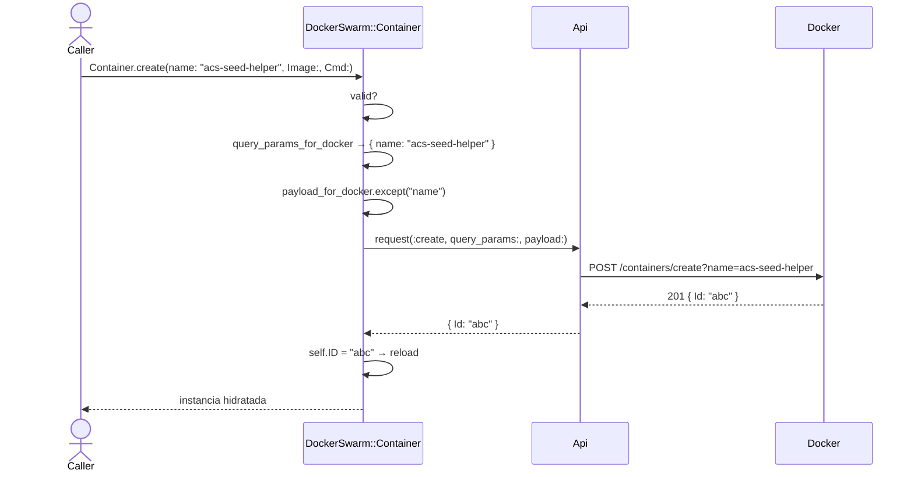

**Notas load-bearing:**
- El split lo declara el modelo con `.create_query_params` (`%w[name]` en `Container`); el default del concern es `[]`, así que los demás modelos Creatable no cambian de comportamiento.
- **El atributo se excluye del payload**, no se duplica: mandarlo en los dos lados no da error pero deja el body con una clave que Docker ignora.
- Hereda el flujo §3.1: `valid?` antes del POST, `reload` después, y **sin retry** por ser `POST` (§3.5). Si el `create` falla por `Communication`, el caller decide — con nombre determinista puede adoptar el existente en el reintento.

### 3.12 `Model.where` — partición query params propios vs. `?filters=`

El Engine parte los parámetros de un listado en dos grupos, y la gema tiene que decidir a cuál va cada clave **antes** de armar la URL. `Base.index_query_params` es esa declaración; todo lo que no esté ahí se serializa dentro del JSON de `?filters=`.

La trampa: un query param propio que el modelo no declaró **no llega**. Viaja dentro de `filters`, donde el Engine lo rechaza o lo ignora según el recurso — no hay error que diga "esa clave iba en la URL".

```mermaid
flowchart TD
    A["Model.where(status: true, name: 'web')"] --> B["_fetch_all"]
    B --> C{"clave ∈ index_query_params?"}
    C -->|sí| D["query params propios<br/>{ status: true }"]
    C -->|no| E["docker_filters<br/>{ name: 'web' }"]
    E --> F["downcase claves + Array(valor)<br/>→ JSON"]
    D --> G["query = { status: true,<br/>filters: '{\"name\":[\"web\"]}' }"]
    F --> G
    G --> H["GET /services?status=true&filters=..."]
    H --> I["array de Hash → instancias"]
```

**Notas load-bearing:**
- **La lista es por modelo, no global.** `Base` declara `%i[all force limit since before]`; `Service` la extiende con `:status`. Deliberadamente no se generaliza: `status` es query param propio en `/services` pero **filtro válido** en `/containers/json` (`running`, `exited`, …), así que subirlo a `Base` lo sacaría del `?filters=` donde containers lo necesita. Hay un spec de regresión que lo fija.
- **`Service.where(status: true)` es lo que habilita leer `ServiceStatus`** (`RunningTasks` · `DesiredTasks` · `CompletedTasks`), única superficie donde el Engine publica el **deseado** de un service en modo `global` — un replicado lo tiene en `Spec.Mode.Replicated.Replicas`, un global no tiene ese campo. Sin eso, un global corriendo en 2 de 3 nodos elegibles es indistinguible de uno sano: se ven las tasks que corren, no contra qué comparar.
- **Requiere API ≥ v1.41 y degrada en silencio.** La gema no fija `?version=` (§3.5 / [`docs/consumed/`](../consumed/docker-engine-api.md)); en un Engine anterior el parámetro se ignora sin error y `ServiceStatus` llega ausente → el consumidor tolera `nil`, no hay señal de "no soportado".
- **`DesiredTasks` arranca en 0 en un `global` recién creado** y el Engine lo completa después de evaluar los nodos (~1s, medido). En esa ventana `RunningTasks == DesiredTasks == 0`: el deseado no está calculado, así que comparar los dos números miente. Precondición de salud = `DesiredTasks.positive?`. Detalle en [`docs/consumed/`](../consumed/docker-engine-api.md).
- **Las claves se matchean como símbolos.** `where("status" => true)` cae en `docker_filters` (`slice(:status)` no matchea la string). Comportamiento preexistente y común a todos los query params del listado, no introducido por `:status`.
- Sin filtros no hay query: `all` manda `query_params: {}` — el listado por default no cambió.

## 4. Cobertura y fronteras

- **Cobertura (RFC-007 backfill on-demand + incremental):** 8 flujos load-bearing en el backfill inicial + 2 agregados con el soporte de auth de registry privado (auth de registry privado, `Image.pull` síncrono) + 1 con el `create` de containers + 1 con la partición query params/filters del listado = 12. Esta gema es chica; el backfill completo era factible y se hizo, y a partir de ahí se acreta por PR.
- **Frontera con glosario:** términos (Service, Spec, Version.Index, etc.) viven en [`docs/glossary/glossary.md`](../glossary/glossary.md). Esta capa documenta secuencias, no significado.
- **Frontera con configuración:** `DockerSwarm.configure` es boot, no flujo de negocio. No se diagrama.
- **No localizable / fuera de alcance:**
  - Lógica interna de Excon (retry timing, socket pool) — vive en Excon, no se inventa diagrama.
  - Nada pendiente por este motivo. (Hasta el 2026-08-03 esta línea decía que la gema no implementaba `X-Registry-Auth` y citaba `Image.create`; las dos cosas quedaron obsoletas — la auth de registry está documentada en §3.9 e `Image.create` fue retirado.)
- **Cadencia incremental a partir de acá:** sólo se diagrama un flujo cuando un PR lo toca o agrega. No barrido retroactivo de legacy.
