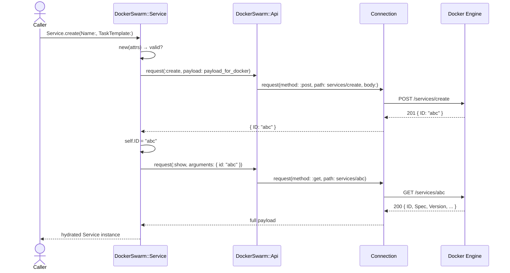
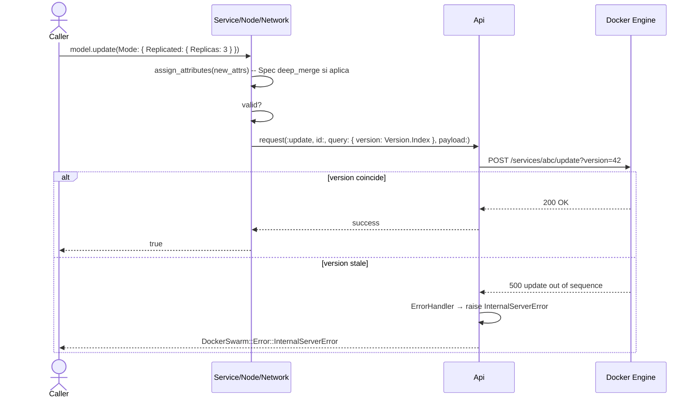
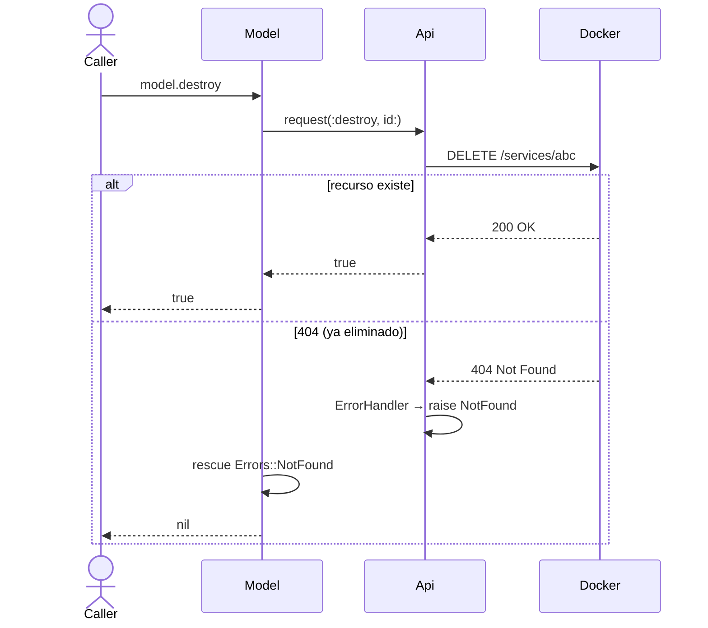
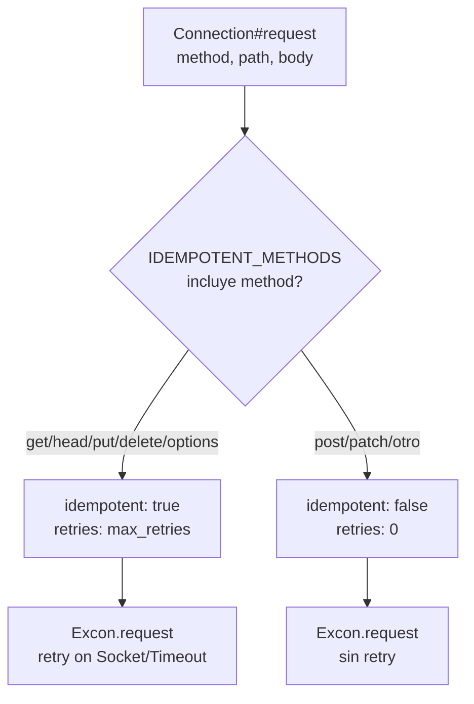
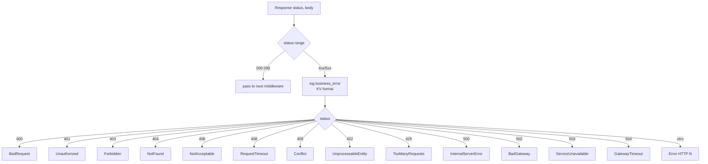
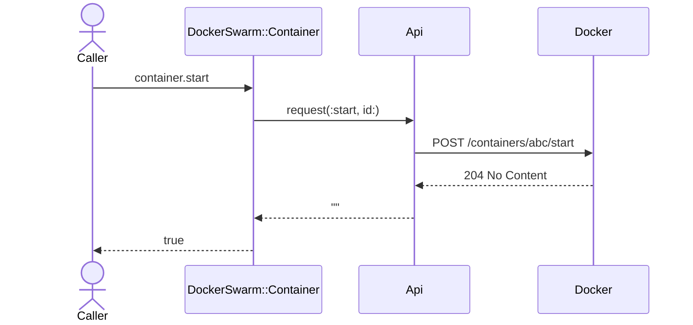
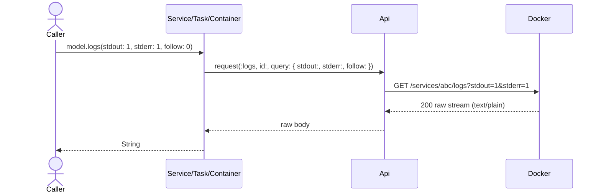

# Comportamiento — docker-swarm

> meta: artefacto · RFC-007 · generado dev-enrich · anclado a `a4e3129` · cobertura: backfill on-demand inicial (8 flujos load-bearing)

## 1. Resumen

Flujos de ejecución load-bearing de `docker-swarm`: cómo se materializan en runtime las operaciones CRUD, el control de concurrencia optimista de Docker, la política de retries post-fix correctness, y el mapeo de errores. Render Mermaid sequenceDiagram/flowchart por flujo.

## 2. Cobertura declarada

### Documentados (8)

1. `Service.create` + reload
2. `Service.update` con `Version.Index`
3. `Service.restart` (force update)
4. `Model.destroy` (graceful 404)
5. Política de retries por método HTTP
6. Error mapping (HTTP status → excepción tipada)
7. `Container.start` / `Container.stop`
8. `Loggable#logs` streaming

### No documentados (ausencia ≠ inexistencia, RFC-007)

- Reconexión / reapertura de socket Unix (Excon nativo, fuera de nuestra superficie).
- Flujo de configuración / boot (`DockerSwarm.configure`) — trivial, sin secuencia de interés.
- Pull de imágenes con autenticación de registry (`X-Registry-Auth`) — **no implementado** en la gema (gap conocido).
- `Container.create` — **no implementado** en F1 (intencional, ver glossary).

## 3. Flujos

### 3.1 `Service.create` + reload

Crear un Service implica un POST seguido de un reload automático para hidratar la instancia con la respuesta completa de Docker (el endpoint `create` sólo devuelve `ID`).



**Notas load-bearing:**
- `valid?` corre antes del POST. Si falla, `save` retorna `false` sin tocar el API.
- El POST no se reintenta automáticamente: ver §3.5 (retry policy).
- El reload usa `find` interno; si Docker devuelve 404 entre create+show (caso extremo), el reload no se realiza y la instancia queda sólo con `ID`.

### 3.2 `Service.update` con `Version.Index`

Updates atómicos sobre Service/Node/Network requieren enviar el `Version.Index` actual como query param. Sin él, Docker rechaza con 500. La gema lo extrae automáticamente de `self.Version["Index"]`.



**Notas load-bearing:**
- `assign_attributes` muta el estado local **antes** de validar/enviar. Si el update falla, la instancia queda mutada (gotcha conocido, ver SKILL.md).
- `Spec` se mergea con `deep_merge`; otros atributos top-level se asignan directo.
- El update **no** hace reload automático (a diferencia de `create`). El caller llama `reload` si necesita el `Version.Index` nuevo.

### 3.3 `Service.restart` (force update)

Reinicio sin downtime equivalente a `docker service update --force`: incrementa `ForceUpdate` del `TaskTemplate` para que Docker recree todas las tasks.

```mermaid
flowchart LR
    A[service.restart] --> B[lee Spec.TaskTemplate.ForceUpdate]
    B --> C[current = ForceUpdate || 0]
    C --> D[update Spec: TaskTemplate: ForceUpdate: current+1]
    D --> E[POST /services/id/update?version=X]
    E --> F[Docker recrea tasks]
```

**Notas load-bearing:**
- Usa el flujo §3.2 internamente — hereda Version.Index, retry-policy y error-mapping.
- Si `Spec` o `TaskTemplate` no existen aún (instancia nueva sin reload), `current = 0`.

### 3.4 `Model.destroy` (graceful 404)

DELETE con tolerancia a 404: si el recurso ya fue eliminado, `destroy` retorna `nil` en vez de raise.



**Notas load-bearing:**
- Tanto `Model.destroy(id)` (class method) como `model.destroy` (instance) capturan `NotFound`.
- 409 (`Conflict` — recurso en uso) **no** se captura; el caller debe manejarlo si aplica.

### 3.5 Política de retries por método HTTP

Post-fix correctness (PR #3): los retries automáticos sólo aplican a métodos seguros. POST/PATCH no reintentan para evitar duplicados.



**Notas load-bearing:**
- Si el socket se cierra durante la lectura de la respuesta de un `services/create`, **no** se replica — la instancia queda en error y el caller decide.
- `max_retries` (default 3) sólo afecta lecturas/idempotentes.

### 3.6 Error mapping (status → excepción)

`ErrorHandler` interpreta status HTTP 4xx/5xx y emite excepción tipada de la jerarquía `DockerSwarm::Error`.



**Notas load-bearing:**
- Antes de raise, `ErrorHandler` emite un evento `business_error` en formato KV con `status`, `message`, `method`, `path`. Permite diagnosticar sin abrir backtrace.
- Errores de red (no HTTP) se mapean a `DockerSwarm::Error::Communication` en `Connection#request`.
- El mensaje de la excepción viene del body parseado: prefiere `body["message"]`, luego `body["error"]`, luego el body completo.

### 3.7 `Container.start` / `Container.stop`

Operaciones específicas sin payload (POST a endpoint dedicado).



Mismo patrón para `stop`. POST sin body → no se reintenta automáticamente (§3.5).

### 3.8 `Loggable#logs` streaming

Obtención de logs raw para Service/Task/Container.



**Notas load-bearing:**
- El body se devuelve sin parseo (no es JSON; `ResponseJSONParser` lo respeta porque Content-Type no es `application/json`).
- `follow: 1` mantiene la conexión abierta — el caller debe manejar el stream/timeout.

## 4. Cobertura y fronteras

- **Cobertura inicial (RFC-007 backfill on-demand):** 8 flujos load-bearing documentados. Esta gema es chica; el backfill completo es factible y se hace ahora.
- **Frontera con glosario:** términos (Service, Spec, Version.Index, etc.) viven en [`docs/glossary/glossary.md`](../glossary/glossary.md). Esta capa documenta secuencias, no significado.
- **Frontera con configuración:** `DockerSwarm.configure` es boot, no flujo de negocio. No se diagrama.
- **No localizable / fuera de alcance:**
  - Lógica interna de Excon (retry timing, socket pool) — vive en Excon, no se inventa diagrama.
  - Flujo de auth registry para `Image.create` — la gema **no implementa** `X-Registry-Auth` (gap, no flujo a documentar).
- **Cadencia incremental a partir de acá:** sólo se diagrama un flujo cuando un PR lo toca o agrega. No barrido retroactivo de legacy.
