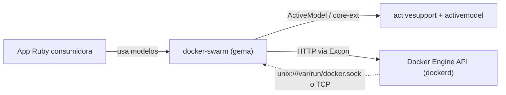

# Topología — docker-swarm

> meta: artefacto · RFC-006 · generado arch-structure · anclado a `15bcd21` · cobertura: dependencias runtime (`.gemspec` + `Gemfile.lock`) y mapa de contexto de la gema

## 1. Resumen

Gema cliente sin servidor propio. Tres dependencias runtime (`activesupport`, `activemodel`, `excon`). Se ubica entre el código Ruby consumidor y el Docker Engine API (vía socket Unix o TCP). No tiene base de datos, colas ni servicios adyacentes propios.

## 2. Cuerpo

### a. Dependencias

Runtime declaradas en `docker-swarm.gemspec`; versiones resueltas en `Gemfile.lock`.

| nombre | versión (constraint) | resuelta | rol |
|---|---|---|---|
| `activesupport` | `>= 6.0` | 8.1.3 | core-ext (`HashWithIndifferentAccess`, `deep_merge`, `blank?`, `demodulize`, `pluralize`) |
| `activemodel` | `>= 6.0` | 8.1.3 | `ActiveModel::Model` (validaciones, API de atributos) en `Base` |
| `excon` | `>= 0.80` | 1.5.0 | cliente HTTP con soporte nativo de Unix socket + stack de middlewares |

Desarrollo / test (no se empaquetan): `rake ~> 13.0`, `rspec ~> 3.0`, `pry`, `rubocop-rails-omakase`.

### b. Grafo de contexto

La gema es el centro: arriba la consume una app Ruby; abajo habla con el daemon Docker por Excon. `activesupport`/`activemodel` son librerías embebidas, no servicios.

### c. Modos de ejecución

No aplica: es una librería embebida en el proceso del consumidor (sin web/worker/cron propios). El único "modo" es el transporte hacia el daemon:

| transporte | configuración | default |
|---|---|---|
| Unix socket | `socket_path = "unix:///var/run/docker.sock"` | sí |
| TCP | `socket_path = "http://host:2375"` | no |

## 3. Inferencias

| afirmación | confidence | a verificar |
|---|---|---|
| `activesupport`/`activemodel` 8.1.3 son las resueltas hoy, pero el constraint `>= 6.0` admite Rails 6/7/8 | declared | `Gemfile.lock` fija 8.1.3; el `.gemspec` no pone techo |
| La gema no abre puertos ni corre procesos propios | declared | sin `config/`, sin `bin/` server, sin Railtie/Engine |

## 4. Cobertura y fronteras

- **Dependencias transitivas:** las de `activesupport` (concurrent-ruby, i18n, tzinfo, etc.) y `excon` (logger) están en `Gemfile.lock` pero no son edges del repo → fuera del grafo de contexto.
- **El daemon Docker** es la única dependencia externa de runtime real; su contrato consumido se detalla en [`docs/consumed/docker-engine-api.md`](../consumed/docker-engine-api.md).
- **Arquitectura upstream** (cómo está desplegado el cluster Swarm que la gema administra) es del operador, no del repo → fuera de alcance.
